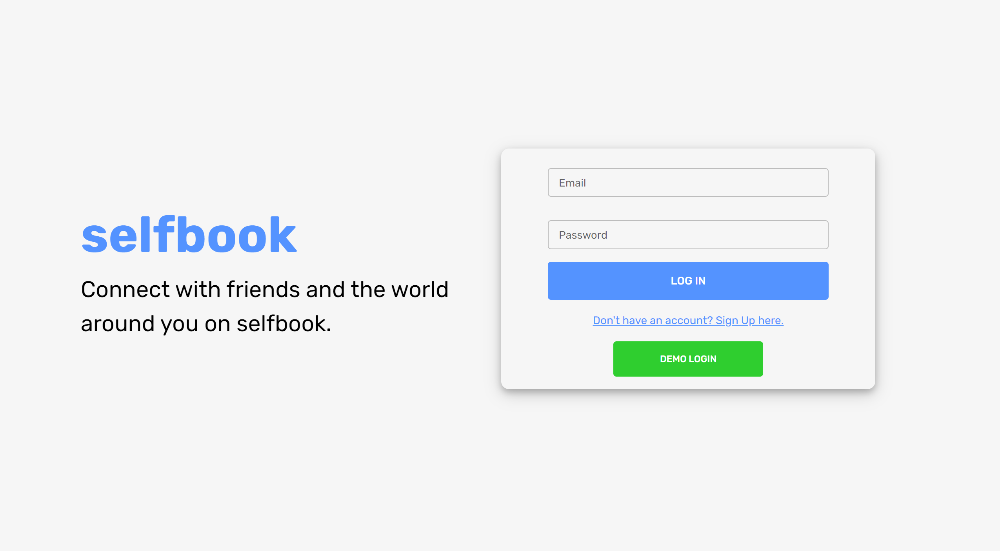
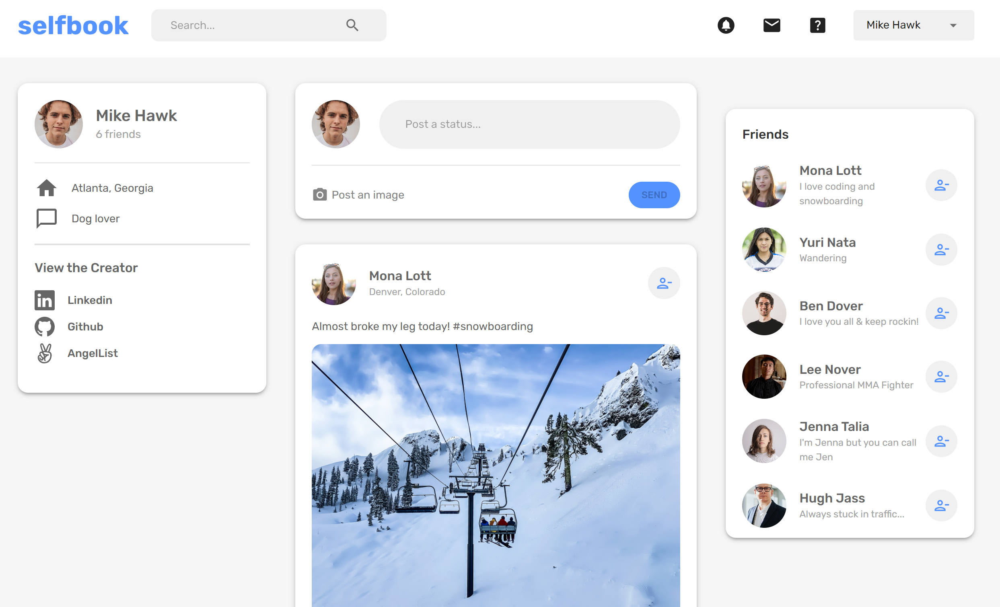
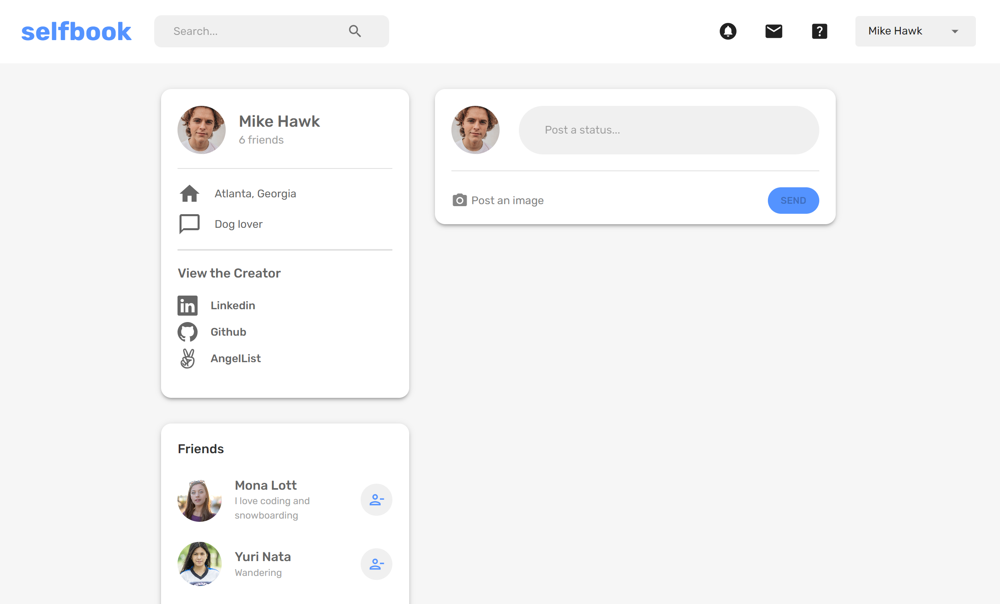
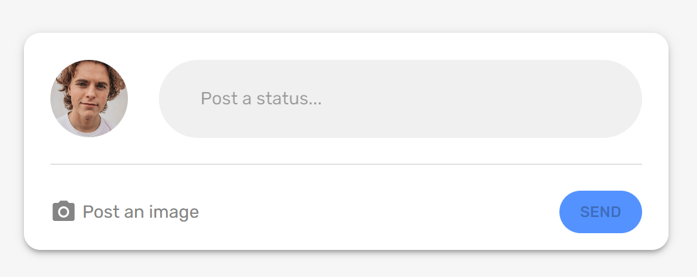
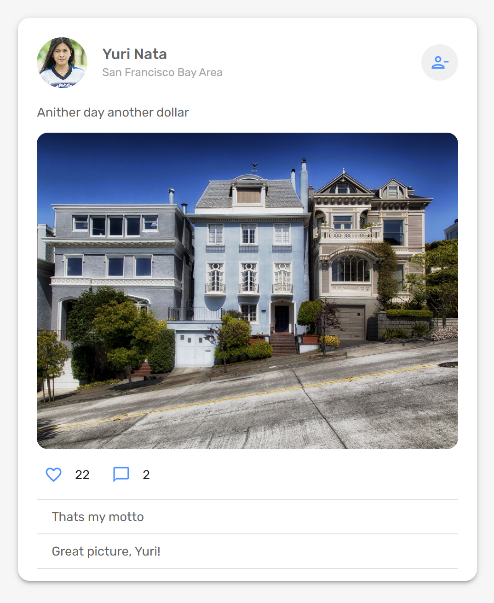

# Selfbook

[Selfbook LIVE on Heroku](https://selfbooksb.herokuapp.com/)

Selfbook is a full-stack clone of the popular social media platform Facebook, where users can add friends and make posts to the web

# Technologies Used

* Backend 
  * Node.js
  * Express
  * MongoDB
* Frontend
  * React
  * Redux
  * HTML5
  * CSS
* Hosting
  * Heroku

# Features

## User Authentication

Users can log in to their account by entering into the form on the homepage. To create a personal account, a user must fill in the form which is rendered after clicking 'Don't have an account? Sign Up here'. There is also a demo login. Errors are rendered if there is incorrect input.

</img>

## Home Page

Upon successful login, users will be redirected to the Home Feed page, where they can view their account info, friends list, a list of most recent posts, and the input to create a post

</img>

## Friends List

On the user's person's profile page, their friends list is rendered. This component calls the person's friends to be rendered via a "GET" request to '/users/token/friends' in the getFriends() function defined below. 

```javascript
// client/src/components/FriendListComponent.jsx
const dispatch = useDispatch();
const token = useSelector((state) => state.token);
const friends = useSelector((state) => state.user.friends);

const getFriends = async () => {
const response = await fetch(
    `http://localhost:3001/users/${userId}/friends`,
    {
    method: "GET",
    headers: { Authorization: `Bearer ${token}` },
    }
);
const data = await response.json();
dispatch(setFriends({ friends: data }));
};

useEffect(() => {
getFriends();
}, []); // eslint-disable-line react-hooks/exhaustive-deps

```

On a person's profile page who is not the main user, their personal friends are still rendered in the component due to configurations in the getUserFriends() functionality in the Users controller

```javascript
// controllers/users.js
export const getUserFriends = async (req, res) => {
  try {
    const { id } = req.params;
    const user = await User.findById(id);

    const friends = await Promise.all(
      user.friends.map((id) => User.findById(id))
    );
    const formattedFriends = friends.map(
      ({ _id, firstName, lastName, description, location, picturePath }) => {
        return { _id, firstName, lastName, description, location, picturePath };
      }
    );
    res.status(200).json(formattedFriends);
  } catch (err) {
    res.status(404).json({ message: err.message });
  }
};

```

</img>

## Making Posts

On the home feed, there is an input for a user to post a status, post an image, or both. There is a createPost() function in posts controller which handles creating the post by calling the React router and the rest is returned to the handlePost() function in the MyPost component

```javascript
// client/src/pages/widgets/MyPostWidget.jsx
  const dispatch = useDispatch();
  const [image, setImage] = useState(null);
  const [post, setPost] = useState("");
  const { _id } = useSelector((state) => state.user);
  const token = useSelector((state) => state.token);

  const handlePost = async () => {
    const formData = new FormData();
    formData.append("userId", _id);
    formData.append("description", post);
    if (image) {
      formData.append("picture", image);
      formData.append("picturePath", image.name);
    }

    const response = await fetch(`http://localhost:3001/posts`, {
      method: "POST",
      headers: { Authorization: `Bearer ${token}` },
      body: formData,
    });
    const posts = await response.json();
    dispatch(setPosts({ posts }));
    setImage(null);
    setPost("");
  };

```

</img>

## Viewing Comments

Users can view posted comments on individual posts

</img>

## Future Features
* Posting Video 
* Posting Audio
* Posting Comments